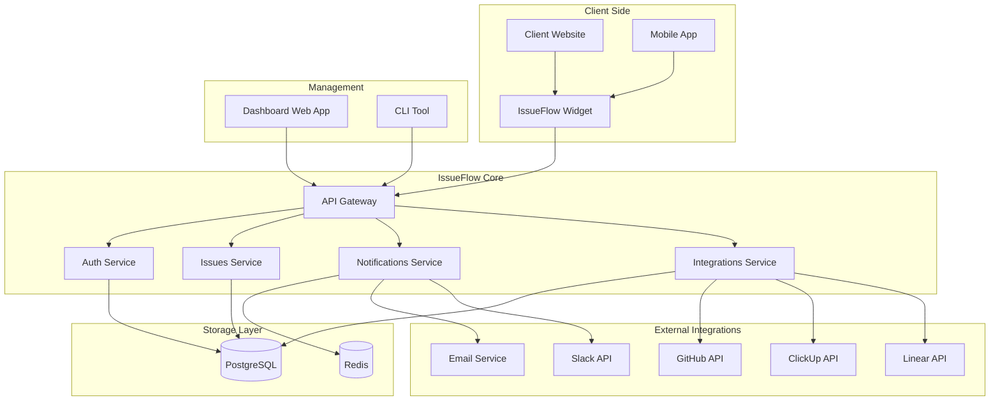
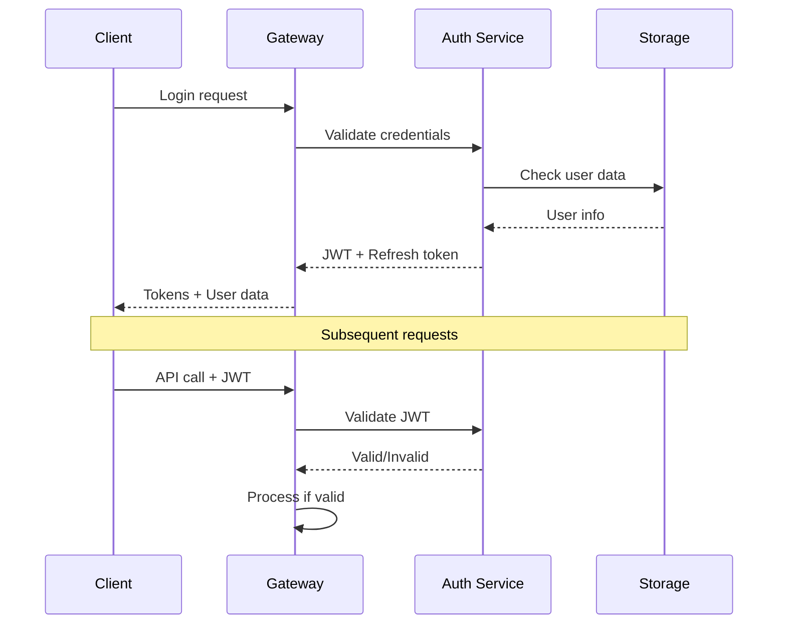

# 🏗️ ARQUITECTURA - IssueFlow Framework

## 🎯 Overview

IssueFlow es un framework multi-tenant que conecta feedback de clientes no-técnicos con workflows de desarrollo mediante automatización completa.

---

## 🏢 Arquitectura General



---

## 🧩 Componentes del Sistema

### 1. 🎨 Frontend Components

#### Widget Client (Embeddable)
```typescript
// Core widget que se embebe en websites
@issueflow/widget-core
├── react/          # React adapter
├── vue/            # Vue adapter  
├── vanilla/        # Pure JS adapter
├── angular/        # Angular adapter
└── svelte/         # Svelte adapter
```

**Características**:
- Bundle size < 50KB gzipped
- Framework agnostic core
- Customizable UI/UX
- Offline support
- A11y compliant

#### Dashboard Web App
```typescript
@issueflow/dashboard
├── pages/          # Next.js pages
├── components/     # Reusable components
├── hooks/          # Custom hooks
├── stores/         # Zustand stores
└── utils/          # Utilities
```

**Stack**: Next.js 14, TypeScript, Tailwind CSS, Zustand

### 2. ⚙️ Backend Services

#### API Gateway
```typescript
@issueflow/gateway
├── middleware/     # Auth, rate limiting, CORS
├── routes/         # Route definitions
├── validation/     # Request validation
└── proxy/          # Service routing
```

**Responsabilidades**:
- Request routing
- Authentication
- Rate limiting
- Request validation
- Response caching

#### Auth Service
```typescript
@issueflow/auth-service
├── controllers/    # Auth endpoints
├── middleware/     # JWT validation
├── models/         # User models
├── providers/      # OAuth providers
└── utils/          # Auth utilities
```

**Características**:
- JWT + Refresh tokens
- Multi-tenant isolation
- OAuth providers (Google, GitHub)
- Role-based permissions
- Session management

#### Issues Service
```typescript
@issueflow/issues-service
├── controllers/    # CRUD operations
├── models/         # Issue models
├── processors/     # Issue processing
├── workflows/      # Automation rules
└── templates/      # Issue templates
```

**Responsabilidades**:
- Issue lifecycle management
- Workflow automation
- Status tracking
- Comments & attachments
- Search & filtering

#### Integrations Service
```typescript
@issueflow/integrations-service
├── providers/      # Integration providers
├── webhooks/       # Webhook handlers
├── sync/           # Data synchronization
├── mapping/        # Field mapping
└── queue/          # Job processing
```

**Integraciones**:
- **Dev Tools**: GitHub, GitLab, Linear, Asana
- **Communication**: Slack, Discord, Teams
- **Project Mgmt**: ClickUp, Monday, Trello
- **CRM**: HubSpot, Salesforce

#### Notifications Service
```typescript
@issueflow/notifications-service
├── channels/       # Notification channels
├── templates/      # Message templates
├── queue/          # Notification queue
├── preferences/    # User preferences
└── analytics/      # Delivery tracking
```

### 3. 🛠️ CLI Tool

```typescript
@issueflow/cli
├── commands/       # CLI commands
├── templates/      # Project templates
├── generators/     # Code generators
├── config/         # Configuration mgmt
└── utils/          # Utilities
```

**Comandos principales**:
```bash
npx create-issueflow        # Setup wizard
issueflow init              # Initialize existing project
issueflow config            # Configure integrations
issueflow deploy            # Deploy to cloud
issueflow plugins           # Manage plugins
issueflow dev               # Development mode
```

### 4. 📦 SDK & APIs

#### JavaScript/TypeScript SDK
```typescript
@issueflow/sdk
├── client/         # API client
├── types/          # TypeScript definitions
├── utils/          # Helper utilities
├── webhooks/       # Webhook verification
└── plugins/        # Plugin system
```

#### REST API
```yaml
# OpenAPI 3.0 Specification
/api/v1/
├── /auth           # Authentication
├── /issues         # Issues management
├── /projects       # Project management
├── /integrations   # External integrations
├── /webhooks       # Webhook management
├── /users          # User management
└── /analytics      # Usage analytics
```

#### GraphQL API
```graphql
type Query {
  issues(filters: IssueFilters): [Issue!]!
  projects: [Project!]!
  integrations: [Integration!]!
}

type Mutation {
  createIssue(input: CreateIssueInput!): Issue!
  updateIssue(id: ID!, input: UpdateIssueInput!): Issue!
  deleteIssue(id: ID!): Boolean!
}

type Subscription {
  issueUpdated(projectId: ID!): Issue!
  newIssue(projectId: ID!): Issue!
}
```

---

## 🗄️ Data Architecture

### Database Schema

```sql
-- Multi-tenant architecture
CREATE TABLE organizations (
    id UUID PRIMARY KEY,
    name VARCHAR(255) NOT NULL,
    slug VARCHAR(100) UNIQUE NOT NULL,
    settings JSONB,
    created_at TIMESTAMP DEFAULT NOW()
);

CREATE TABLE projects (
    id UUID PRIMARY KEY,
    organization_id UUID REFERENCES organizations(id),
    name VARCHAR(255) NOT NULL,
    domain VARCHAR(255),
    config JSONB,
    created_at TIMESTAMP DEFAULT NOW()
);

CREATE TABLE issues (
    id UUID PRIMARY KEY,
    project_id UUID REFERENCES projects(id),
    title VARCHAR(500) NOT NULL,
    description TEXT,
    status issue_status DEFAULT 'open',
    priority issue_priority DEFAULT 'medium',
    reporter_email VARCHAR(255),
    assignee_id UUID REFERENCES users(id),
    metadata JSONB,
    created_at TIMESTAMP DEFAULT NOW(),
    updated_at TIMESTAMP DEFAULT NOW()
);

-- Integrations & Webhooks
CREATE TABLE integrations (
    id UUID PRIMARY KEY,
    organization_id UUID REFERENCES organizations(id),
    provider integration_provider NOT NULL,
    config JSONB NOT NULL,
    is_active BOOLEAN DEFAULT true
);
```

### Caching Strategy

```typescript
// Redis caching layers
const CACHE_KEYS = {
  USER_SESSION: 'session:{userId}',
  PROJECT_CONFIG: 'project:{projectId}:config',
  INTEGRATION_STATUS: 'integration:{integrationId}:status',
  ISSUE_COUNT: 'stats:{projectId}:issues:count',
  RATE_LIMIT: 'rate_limit:{userId}:{endpoint}'
};

// TTL policies
const TTL = {
  SESSION: 24 * 60 * 60,      // 24 hours
  CONFIG: 60 * 60,            // 1 hour
  STATS: 5 * 60,              // 5 minutes
  RATE_LIMIT: 60              // 1 minute
};
```

---

## 🔌 Plugin System Architecture

### Plugin Types

1. **Frontend Adapters**: Framework-specific widgets
2. **Integration Plugins**: External service connectors
3. **Workflow Plugins**: Custom automation rules
4. **Notification Plugins**: Custom notification channels

### Plugin API

```typescript
interface IssueFlowPlugin {
  name: string;
  version: string;
  type: PluginType;
  
  install(config: PluginConfig): Promise<void>;
  uninstall(): Promise<void>;
  
  // Hooks system
  onIssueCreated?(issue: Issue): Promise<void>;
  onIssueUpdated?(issue: Issue): Promise<void>;
  onStatusChanged?(issue: Issue, oldStatus: string): Promise<void>;
}

// Plugin manifest
interface PluginManifest {
  name: string;
  version: string;
  description: string;
  author: string;
  type: PluginType;
  permissions: Permission[];
  config: ConfigSchema;
  hooks: Hook[];
}
```

---

## 🚀 Deployment Architecture

### Development Environment

```yaml
# docker-compose.dev.yml
version: '3.8'
services:
  gateway:
    build: ./packages/gateway
    ports: ['3000:3000']
    environment:
      - NODE_ENV=development
      - DATABASE_URL=postgresql://...
      - REDIS_URL=redis://...
  
  auth-service:
    build: ./packages/auth-service
    ports: ['3001:3001']
    
  issues-service:
    build: ./packages/issues-service  
    ports: ['3002:3002']
    
  postgres:
    image: postgres:15
    environment:
      POSTGRES_DB: issueflow_dev
      
  redis:
    image: redis:7-alpine
```

### Production Infrastructure

```yaml
# Kubernetes deployment
apiVersion: apps/v1
kind: Deployment
metadata:
  name: issueflow-gateway
spec:
  replicas: 3
  selector:
    matchLabels:
      app: issueflow-gateway
  template:
    spec:
      containers:
      - name: gateway
        image: issueflow/gateway:latest
        ports:
        - containerPort: 3000
        env:
        - name: DATABASE_URL
          valueFrom:
            secretKeyRef:
              name: db-credentials
              key: url
```

### CDN & Edge

```typescript
// Edge functions for performance
// Deployed on Vercel Edge Functions / Cloudflare Workers

export default async function handler(request: Request) {
  // Widget serving optimized by region
  // Static assets cached globally
  // API responses cached with edge cache
}
```

---

## 🔒 Security Architecture

### Authentication Flow



### Security Measures

- **JWT Authentication**: Short-lived access tokens + refresh tokens
- **Rate Limiting**: Per-user and per-IP limits
- **Input Validation**: Schema validation on all endpoints
- **SQL Injection Prevention**: Parameterized queries
- **XSS Protection**: Content sanitization
- **CORS**: Configured allowed origins
- **HTTPS Only**: TLS 1.3 minimum
- **CSP Headers**: Strict content security policy

---

## 📊 Monitoring & Analytics

### Application Monitoring

```typescript
// Observability stack
const monitoring = {
  metrics: 'Prometheus + Grafana',
  logging: 'Winston + ELK Stack',
  tracing: 'OpenTelemetry + Jaeger',
  errors: 'Sentry',
  uptime: 'StatusPage'
};

// Key metrics
const KPIs = {
  technical: [
    'Response time (p95 < 200ms)',
    'Error rate (< 0.1%)',
    'Uptime (99.9%+)',
    'Database query time'
  ],
  business: [
    'Issues created per day',
    'Resolution time',
    'User engagement',
    'Integration usage'
  ]
};
```

### Usage Analytics

```typescript
// Privacy-first analytics
interface AnalyticsEvent {
  event: string;
  projectId: string;
  timestamp: Date;
  metadata?: Record<string, any>;
  // No PII data stored
}

const trackingEvents = [
  'widget_loaded',
  'issue_created', 
  'issue_resolved',
  'integration_triggered',
  'user_feedback_submitted'
];
```

---

## 🌍 Multi-Region Architecture

### Global Distribution

```yaml
Regions:
  - us-east-1: Primary (Virginia)
  - eu-west-1: Secondary (Ireland) 
  - ap-southeast-1: Tertiary (Singapore)

Data Strategy:
  - User data: Regional compliance (GDPR)
  - Static assets: Global CDN
  - API responses: Edge caching
  - Database: Regional replicas
```

---

## 🔄 Backup & Disaster Recovery

### Backup Strategy

```yaml
Database Backups:
  - Full: Daily at 2 AM UTC
  - Incremental: Every 6 hours
  - Retention: 30 days
  - Cross-region: Encrypted backups

File Storage:
  - Real-time: Cross-region replication
  - Snapshots: Daily
  - Retention: 90 days

Recovery Targets:
  - RTO: < 4 hours
  - RPO: < 1 hour
```

---

## 📈 Scalability Considerations

### Horizontal Scaling

- **Stateless Services**: All services designed stateless
- **Database Sharding**: By organization_id
- **Queue Processing**: Distributed job processing
- **CDN**: Global edge locations
- **Auto-scaling**: Based on CPU/memory metrics

### Performance Targets

| Metric | Target | Current |
|--------|--------|---------|
| API Response (p95) | < 200ms | TBD |
| Widget Load Time | < 500ms | TBD |
| Database Queries | < 50ms | TBD |
| Uptime | 99.9% | TBD |

---

**Última actualización**: 2025-09-05  
**Versión arquitectura**: 1.0  
**Próxima revisión**: Fin de Fase 1