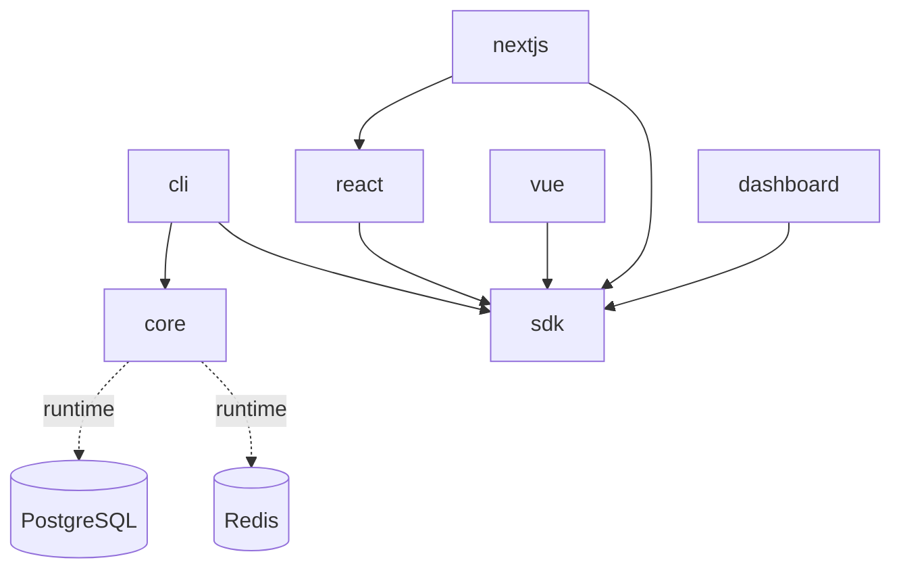

# 📦 IssueFlow Packages

Esta carpeta contiene todos los packages del monorepo IssueFlow, organizados por funcionalidad.

## 🏗️ Estructura de Packages

### 🔧 Core Framework
- **[@issueflow/core](./core/)** - Framework principal multi-tenant con API y servicios
- **[@issueflow/sdk](./sdk/)** - JavaScript/TypeScript SDK para integración con API

### 🛠️ Developer Tools
- **[@issueflow/cli](./cli/)** - Herramienta CLI para setup y gestión de proyectos

### 🎨 Framework Adapters
- **[@issueflow/react](./react/)** - Componentes React para feedback widgets
- **[@issueflow/vue](./vue/)** - Componentes Vue.js para feedback widgets  
- **[@issueflow/nextjs](./nextjs/)** - Integración específica para Next.js
- **[@issueflow/nuxt](./nuxt/)** - Integración específica para Nuxt (coming soon)
- **[@issueflow/astro](./astro/)** - Integración específica para Astro (coming soon)

### 🖥️ Applications  
- **[@issueflow/dashboard](./dashboard/)** - Dashboard web para gestión (Next.js app)

## 🔗 Dependencias entre Packages



## 🚀 Development Workflow

### Setup Inicial
```bash
# En la raíz del proyecto
npm install                    # Instala dependencias de todos los packages
npm run build                  # Build todos los packages
npm run dev                    # Modo desarrollo (watch mode)
```

### Trabajar con Packages Específicos
```bash
# Trabajar solo en el core
cd packages/core
npm run dev

# Trabajar solo en React adapter
cd packages/react  
npm run dev

# Ejecutar tests en todos los packages
npm run test

# Ejecutar linting
npm run lint
```

### Build & Release
```bash
# Build production de todos los packages
npm run build

# Crear changeset para versionado
npx changeset

# Release (solo maintainers)
npm run release
```

## 📋 Package Standards

### Estructura de Archivos
Cada package sigue esta estructura estándar:
```
package/
├── src/                    # Código fuente
│   ├── index.ts           # Entry point principal
│   ├── types/             # Type definitions
│   ├── utils/             # Utilidades
│   └── ...                # Código específico del package
├── dist/                  # Build output (gitignored)
├── package.json           # Package configuration
├── tsconfig.json          # TypeScript config
├── README.md              # Package documentation
└── CHANGELOG.md           # Version history (auto-generated)
```

### Naming Conventions
- **Package names**: `@issueflow/package-name`
- **Exports**: Named exports preferidos, default exports solo cuando sea necesario
- **Types**: Interfaces con prefix `I`, Types con suffix `Type`, Enums en PascalCase

### Versioning Strategy
- **Semantic Versioning**: MAJOR.MINOR.PATCH
- **Synchronized releases**: Todos los packages se versionan juntos
- **Changesets**: Para manejo automático de changelog y releases

## 🧪 Testing Strategy

### Unit Tests
```bash
# En cada package
npm run test                # Run tests once  
npm run test:watch          # Watch mode
```

### Integration Tests
```bash
# En la raíz del proyecto
npm run test               # Run tests de todos los packages
```

### E2E Tests
```bash
# Tests end-to-end (coming soon)
npm run test:e2e
```

## 🔒 Publishing

Los packages se publican automáticamente a NPM cuando se hace merge de un Release PR.

### Public Packages (NPM)
- `@issueflow/core`
- `@issueflow/sdk` 
- `@issueflow/cli`
- `@issueflow/react`
- `@issueflow/vue`
- `@issueflow/nextjs`

### Private Packages
- `@issueflow/dashboard` - Web application, no se publica

## 📚 Documentation

Cada package mantiene su propia documentación en su carpeta README.md. Para documentation general del proyecto, ver el [README principal](../README.md).

---

**Última actualización**: 2025-09-05  
**Packages activos**: 7  
**Versión actual**: v0.2.0